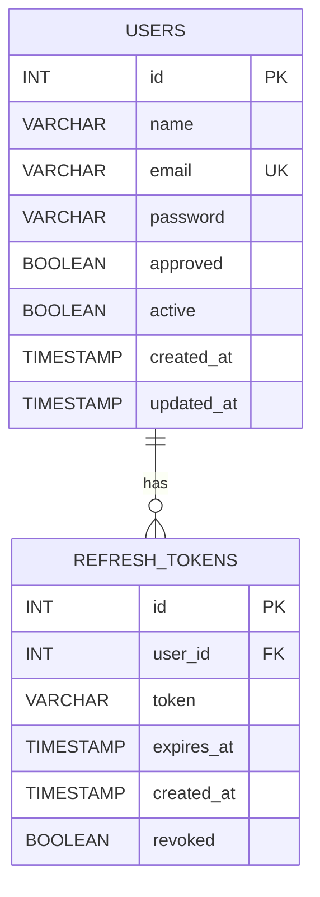
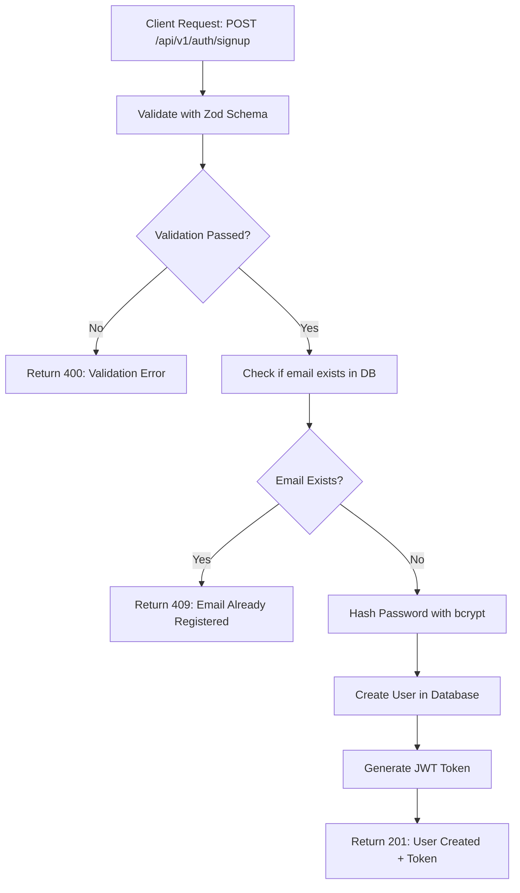
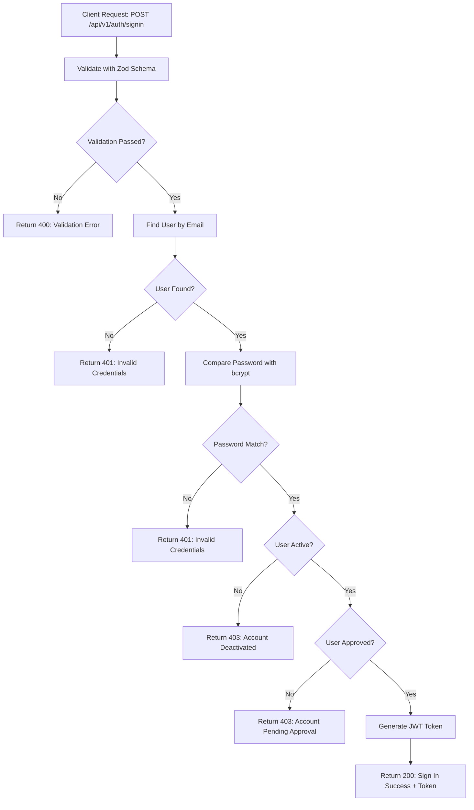
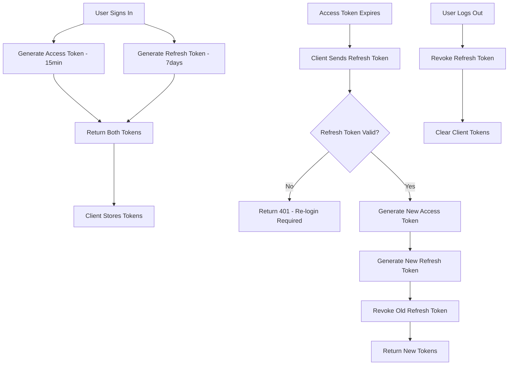
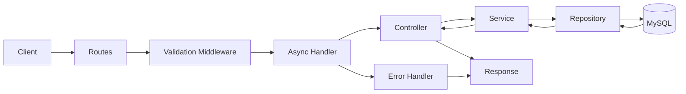

# Authentication Architecture Plan

## Overview

This document outlines the architecture for implementing user authentication (Sign Up & Sign In) with the following stack:

- **Database**: MySQL
- **Password Hashing**: bcrypt
- **Authentication**: JWT-based
- **Validation**: Zod
- **Architecture Pattern**: Repository + Service Layer

---

## 1. Folder Structure

```
backend/
src/
  config/                    # Configuration files
    database.ts              # MySQL connection pool
    jwt.ts                   # JWT secret and config
    index.ts                 # Export all configs

  types/                     # TypeScript types/interfaces
    user.types.ts            # User entity types
    auth.types.ts            # Auth request/response types
    index.ts                 # Export all types

  repository/                # Database operations only
    user.repository.ts       # User CRUD operations
    refreshToken.repository.ts # Refresh token CRUD operations
    index.ts                 # Export all repositories

  service/                   # Business logic layer
    auth.service.ts          # Authentication logic
    user.service.ts          # User management logic
    index.ts                 # Export all services

  controller/                # Request handlers
    auth.controller.ts       # Auth controllers
    index.ts                 # Export all controllers

  routes/                    # Route definitions
    index.ts                 # Main router
    v1/
      index.ts               # V1 router
      auth.routes.ts         # Auth routes

  middleware/                # Express middlewares
    asyncHandler.ts          # Async wrapper for error handling
    errorHandler.ts          # Global error handler
    authMiddleware.ts        # JWT verification middleware
    validateRequest.ts       # Zod validation middleware
    index.ts                 # Export all middlewares

  util/                      # Utility functions
    zodValidator/            # Zod schemas
      auth.schema.ts         # Auth validation schemas
      index.ts               # Export all schemas
    passwordHash.ts          # bcrypt utilities
    jwtUtils.ts              # JWT generation/verification
    index.ts                 # Export all utilities

  error/                     # Error classes
    AppError.ts              # Custom error class
    ValidationError.ts       # Validation error class
    UnauthorizedError.ts     # Auth error class
    NotFoundError.ts         # Not found error class
    index.ts                 # Export all errors

  server.ts                  # Express app entry point
```

---

## 2. Database Schema

### Users Table

```sql
CREATE TABLE users (
  id INT AUTO_INCREMENT PRIMARY KEY,
  name VARCHAR(255) NOT NULL,
  email VARCHAR(255) NOT NULL UNIQUE,
  password VARCHAR(255) NOT NULL,
  approved BOOLEAN DEFAULT FALSE,
  active BOOLEAN DEFAULT TRUE,
  created_at TIMESTAMP DEFAULT CURRENT_TIMESTAMP,
  updated_at TIMESTAMP DEFAULT CURRENT_TIMESTAMP ON UPDATE CURRENT_TIMESTAMP,

  INDEX idx_email (email),
  INDEX idx_approved (approved),
  INDEX idx_active (active)
);
```

### Refresh Tokens Table

```sql
CREATE TABLE refresh_tokens (
  id INT AUTO_INCREMENT PRIMARY KEY,
  user_id INT NOT NULL,
  token VARCHAR(500) NOT NULL,
  expires_at TIMESTAMP NOT NULL,
  created_at TIMESTAMP DEFAULT CURRENT_TIMESTAMP,
  revoked BOOLEAN DEFAULT FALSE,

  FOREIGN KEY (user_id) REFERENCES users(id) ON DELETE CASCADE,
  INDEX idx_user_id (user_id),
  INDEX idx_token (token(255)),
  INDEX idx_expires_at (expires_at)
);
```

### Entity Diagram



---

## 3. API Endpoints Design

### Sign Up Flow



### Sign In Flow



### Endpoints Summary

| Method | Endpoint             | Description          | Request Body          | Response                                |
| ------ | -------------------- | -------------------- | --------------------- | --------------------------------------- |
| POST   | /api/v1/auth/signup  | Register new user    | name, email, password | 201: user + accessToken + refreshToken  |
| POST   | /api/v1/auth/signin  | Authenticate user    | email, password       | 200: user + accessToken + refreshToken  |
| POST   | /api/v1/auth/refresh | Refresh access token | refreshToken          | 200: new accessToken + new refreshToken |
| POST   | /api/v1/auth/logout  | Logout user          | refreshToken          | 200: logout success                     |
| GET    | /api/v1/auth/me      | Get current user     | -                     | 200: user profile                       |

### Token Flow Diagram



---

## 4. Error Handling Strategy

### Error Response Format

```typescript
interface ErrorResponse {
  success: false;
  error: {
    code: string; // ERROR_CODE
    message: string; // Human readable message
    details?: any; // Additional details like validation errors
  };
  statusCode: number;
  timestamp: string;
}
```

### Success Response Format

```typescript
interface SuccessResponse<T> {
  success: true;
  data: T;
  message: string;
  statusCode: number;
  timestamp: string;
}
```

### Custom Error Classes

```typescript
// Base AppError
class AppError extends Error {
  public statusCode: number;
  public code: string;
  public isOperational: boolean;

  constructor(message: string, statusCode: number, code: string) {
    super(message);
    this.statusCode = statusCode;
    this.code = code;
    this.isOperational = true;
  }
}

// Specific Error Classes
class ValidationError extends AppError { ... }      // 400
class UnauthorizedError extends AppError { ... }    // 401
class ForbiddenError extends AppError { ... }       // 403
class NotFoundError extends AppError { ... }        // 404
class ConflictError extends AppError { ... }        // 409
```

### Async Handler Middleware

```typescript
// Wraps async route handlers to catch errors automatically
const asyncHandler =
  (fn: Function) => (req: Request, res: Response, next: NextFunction) => {
    Promise.resolve(fn(req, res, next)).catch(next);
  };
```

### Global Error Handler Middleware

```typescript
const errorHandler = (
  err: Error,
  req: Request,
  res: Response,
  next: NextFunction,
) => {
  if (err instanceof AppError) {
    return res.status(err.statusCode).json({
      success: false,
      error: {
        code: err.code,
        message: err.message,
      },
      statusCode: err.statusCode,
      timestamp: new Date().toISOString(),
    });
  }

  // Unexpected errors
  return res.status(500).json({
    success: false,
    error: {
      code: "INTERNAL_ERROR",
      message: "An unexpected error occurred",
    },
    statusCode: 500,
    timestamp: new Date().toISOString(),
  });
};
```

---

## 5. Zod Validation Schemas

```typescript
// auth.schema.ts
import { z } from "zod";

export const signUpSchema = z.object({
  body: z.object({
    name: z.string().min(2, "Name must be at least 2 characters").max(100),
    email: z.string().email("Invalid email format"),
    password: z
      .string()
      .min(8, "Password must be at least 8 characters")
      .regex(/[A-Z]/, "Password must contain at least one uppercase letter")
      .regex(/[a-z]/, "Password must contain at least one lowercase letter")
      .regex(/[0-9]/, "Password must contain at least one number"),
  }),
});

export const signInSchema = z.object({
  body: z.object({
    email: z.string().email("Invalid email format"),
    password: z.string().min(1, "Password is required"),
  }),
});

export const refreshTokenSchema = z.object({
  body: z.object({
    refreshToken: z.string().min(1, "Refresh token is required"),
  }),
});

export const logoutSchema = z.object({
  body: z.object({
    refreshToken: z.string().min(1, "Refresh token is required"),
  }),
});
```

---

## 6. Layer Responsibilities

### Repository Layer

- **Purpose**: Direct database operations only
- **No business logic**
- **Methods**: `create`, `findByEmail`, `findById`, `update`, `delete`

### Service Layer

- **Purpose**: Business logic and orchestration
- **Calls repository methods**
- **Handles**: password hashing, JWT generation, validation logic

### Controller Layer

- **Purpose**: HTTP request/response handling
- **Calls service methods**
- **Returns**: formatted responses

---

## 7. Dependencies to Install

```json
{
  "dependencies": {
    "express": "^5.2.1",
    "cors": "^2.8.6",
    "mysql2": "^3.x",
    "bcrypt": "^5.x",
    "jsonwebtoken": "^9.x",
    "zod": "^3.x",
    "dotenv": "^16.x"
  },
  "devDependencies": {
    "@types/node": "^25.x",
    "@types/express": "^5.x",
    "@types/bcrypt": "^5.x",
    "@types/jsonwebtoken": "^9.x",
    "@types/cors": "^2.x",
    "tsx": "^4.x",
    "typescript": "^5.x"
  }
}
```

---

## 8. Implementation Order

1. **Phase 1: Foundation**
   - Install dependencies
   - Create config files (database, JWT)
   - Create error classes
   - Create utility functions (password hash, JWT)

2. **Phase 2: Data Layer**
   - Create TypeScript types
   - Create database connection
   - Create user repository
   - Create refresh token repository

3. **Phase 3: Business Logic**
   - Create auth service
   - Implement sign up logic
   - Implement sign in logic
   - Implement refresh token logic
   - Implement logout logic

4. **Phase 4: API Layer**
   - Create Zod validation schemas
   - Create validation middleware
   - Create async handler middleware
   - Create auth controller
   - Create auth routes

5. **Phase 5: Error Handling**
   - Create global error handler
   - Integrate with Express app
   - Test error scenarios

6. **Phase 6: Security**
   - Create JWT auth middleware
   - Protect routes requiring authentication

---

## 9. Environment Variables

```env
# Database
DB_HOST=localhost
DB_PORT=3306
DB_USER=root
DB_PASSWORD=your_password
DB_NAME=click_data_dashboard

# JWT
JWT_SECRET=your_super_secret_key_here
JWT_ACCESS_EXPIRES_IN=15m
JWT_REFRESH_EXPIRES_IN=7d

# Server
PORT=3000
NODE_ENV=development
```

---

## 10. Request Flow Diagram


