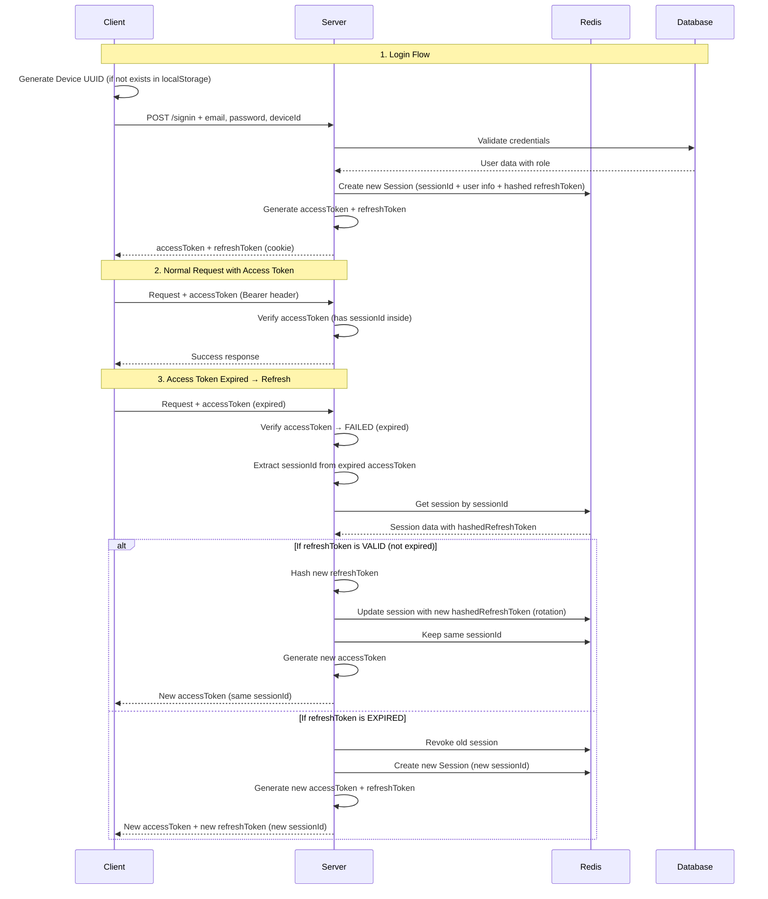

# Session-Based Authentication Architecture

## Authentication Flow



## Token Structure

### Access Token

Contains sessionId and user info for request verification:

```typescript
{
  userId: number;
  email: string;
  roleId: number;
  roleName: string;
  sessionId: string; // Key - used to look up session in Redis
  deviceId: string;
  iat: number;
  exp: number;
}
```

### Refresh Token

Contains only sessionId (sent as HTTP-only cookie):

```typescript
{
  sessionId: string; // Used to validate against session in Redis
  iat: number;
  exp: number;
}
```

## Session Data Structure

```typescript
interface Session {
  id: string; // Session ID (UUID) - matches access/refresh token
  userId: number;
  roleId: number;
  roleName: string;
  deviceId: string; // UUID from localStorage
  hashedRefreshToken: string; // SHA-256 hash of refresh token
  deviceInfo: {
    userAgent?: string;
    ip?: string;
    lastActive: Date;
    deviceName?: string;
  };
  createdAt: Date;
  expiresAt: Date; // Matches refresh token expiry
  isRevoked: boolean;
}
```

## Redis Key Structure

```
Session:{sessionId} -> JSON(Session)
Index:UserSessions:{userId} -> Set<sessionId>
```

Redis TTL will match the refresh token expiry (7 days) for automatic expiration.

## Flow Details

### Access Token Verification Flow

1. Client sends request with access token in Authorization header
2. Server verifies access token signature
3. Server extracts sessionId from access token
4. Server looks up session in Redis using sessionId
5. Server validates session (not revoked, not expired)
6. Server processes request

### Refresh Token Rotation Flow

1. Access token expires → Client gets 401
2. Client sends refresh request with refresh token (cookie)
3. Server extracts sessionId from refresh token
4. Server looks up session in Redis
5. **If refresh token valid** (not expired):
   - Generate new access token (same sessionId)
   - Hash new refresh token and update session
   - Return new access token only
6. **If refresh token expired**:
   - Revoke old session
   - Create new session (new sessionId)
   - Generate new access token + new refresh token
   - Return both tokens

### Session Expiration

- Session expires when refresh token expires (7 days by default)
- Redis handles TTL automatically
- Cron job cleans up expired sessions from database as backup

## Key Implementation Points

1. **Session ID**: Generated once per login, rotates with refresh token
2. **Refresh Token Hashing**: Each refresh rotates the hash in session
3. **Device Binding**: Session tied to deviceId from localStorage
4. **Role in Session**: Role info stored in session for quick access

## Database Schema

```sql
CREATE TABLE IF NOT EXISTS sessions (
  id VARCHAR(36) PRIMARY KEY,
  user_id INT NOT NULL,
  role_id INT NOT NULL,
  device_id VARCHAR(36) NOT NULL,
  hashed_refresh_token VARCHAR(64) NOT NULL,
  expires_at TIMESTAMP NOT NULL,
  created_at TIMESTAMP DEFAULT CURRENT_TIMESTAMP,
  revoked BOOLEAN DEFAULT FALSE,

  FOREIGN KEY (user_id) REFERENCES users(id) ON DELETE CASCADE,
  FOREIGN KEY (role_id) REFERENCES roles(id) ON DELETE CASCADE,
  INDEX idx_user_id (user_id),
  INDEX idx_device_id (device_id),
  INDEX idx_expires_at (expires_at)
);
```
