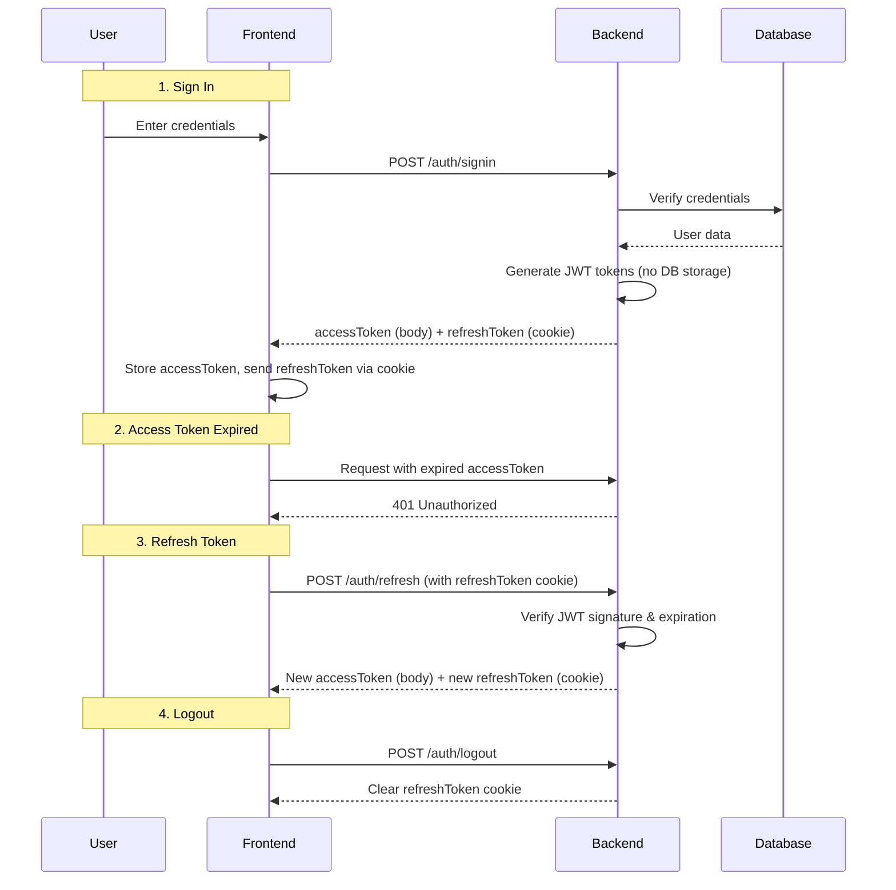

# Stateless Refresh Token Authentication System - Implementation Plan

## Overview

This document outlines the changes needed to convert the existing authentication system from a **stateful** refresh token approach (stored in database) to a **stateless** JWT-based refresh token approach (no database storage).

## Current System Analysis

### Existing Flow

1. **SignUp/SignIn:**
   - Generate access token (15 min) + refresh token (7 days)
   - Store refresh token in `refresh_tokens` database table
   - Return access token in response body
   - Set refresh token as HTTP-only cookie

2. **Token Refresh:**
   - Read refresh token from HTTP-only cookie
   - Verify token exists in database and is not revoked
   - Check token expiration against database
   - Revoke old token, generate new tokens
   - Store new refresh token in database

3. **Logout:**
   - Revoke refresh token in database
   - Clear HTTP-only cookie

## New System Design

### New Flow (Stateless)

1. **SignUp/SignIn:**
   - Generate access token (15 min) + refresh token (7 days)
   - **NO database storage** - token is self-contained JWT
   - Return access token in response body
   - Set refresh token as HTTP-only cookie

2. **Token Refresh:**
   - Read refresh token from HTTP-only cookie
   - Verify JWT signature (using `jwtConfig.secret`)
   - Check token expiration (using JWT `exp` claim)
   - Generate new access token + refresh token
   - Set new refresh token as HTTP-only cookie
   - **NO database operations**

3. **Logout:**
   - Clear HTTP-only cookie
   - **NO database operations needed**

### Architecture Diagram

## Implementation Steps

### Step 1: Update `backend/src/service/auth.service.ts`

#### 1.1 Remove Database Storage in signUp()

- Remove `refreshTokenRepository.create()` call
- Keep token generation (already stateless)

#### 1.2 Remove Database Storage in signIn()

- Remove `refreshTokenRepository.create()` call
- Keep token generation (already stateless)

#### 1.3 Modify refreshToken() Method

- Remove database lookup (`refreshTokenRepository.findByToken()`)
- Remove revocation logic (`refreshTokenRepository.revoke()`)
- Keep JWT verification (`verifyToken()`) - this checks signature + expiration
- Generate new tokens (stateless)
- Remove new token storage in database

#### 1.4 Modify logout() Method

- Remove `refreshTokenRepository.revoke()` call
- Return success message (no DB operations)

### Step 2: Update `backend/src/controller/auth.controller.ts`

The controller should work largely as-is since:

- It already reads refresh token from cookie
- It already sets refresh token as cookie
- It already calls the service methods

Minor review needed to ensure flow is correct.

### Step 3: Verify Frontend Integration

The frontend already handles:

- Reading access token from response body
- Storing access token in Redux store
- Sending refresh token via HTTP-only cookie (via `withCredentials: true`)
- Automatic token refresh on 401 responses

No major changes needed to frontend.

### Step 4: Optional Cleanup

Consider:

- Keeping `refreshTokenRepository.ts` for future use (e.g., token rotation, blacklist)
- Or removing it entirely if not needed
- Updating migration files to note the table is no longer used

## Files to Modify

| File                                               | Changes                                   |
| -------------------------------------------------- | ----------------------------------------- |
| `backend/src/service/auth.service.ts`              | Remove all `refreshTokenRepository` calls |
| `backend/src/repository/index.ts`                  | Optional: remove export                   |
| `backend/src/repository/refreshTokenRepository.ts` | Optional: keep for future or remove       |

## Security Considerations

1. **Token Expiration:** Refresh tokens expire in 7 days (configurable in `jwtUtils.ts`)
2. **HTTPS Only:** Cookies should only be sent over HTTPS in production
3. **SameSite Policy:** Using `strict` to prevent CSRF attacks
4. **No Token Revocation:** Without database storage, tokens cannot be individually revoked before expiration. Consider reducing expiration time if this is a concern.

## Testing Checklist

- [ ] Sign up creates user and returns tokens
- [ ] Sign in authenticates user and returns tokens
- [ ] Access token works for protected endpoints
- [ ] Expired access token triggers refresh
- [ ] Refresh endpoint validates token and returns new tokens
- [ ] Logout clears the cookie
- [ ] Invalid/expired refresh token returns 401
